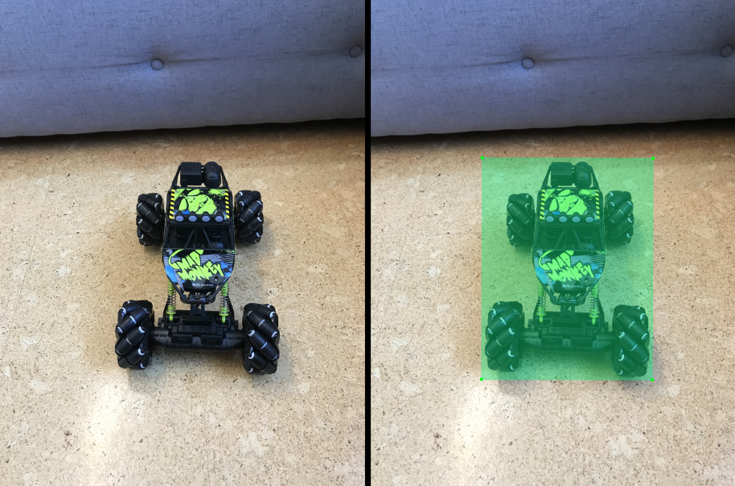
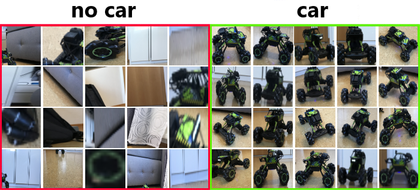
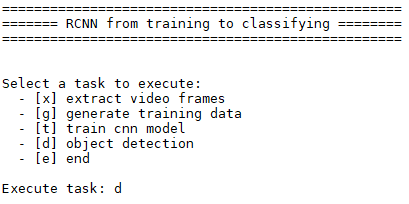
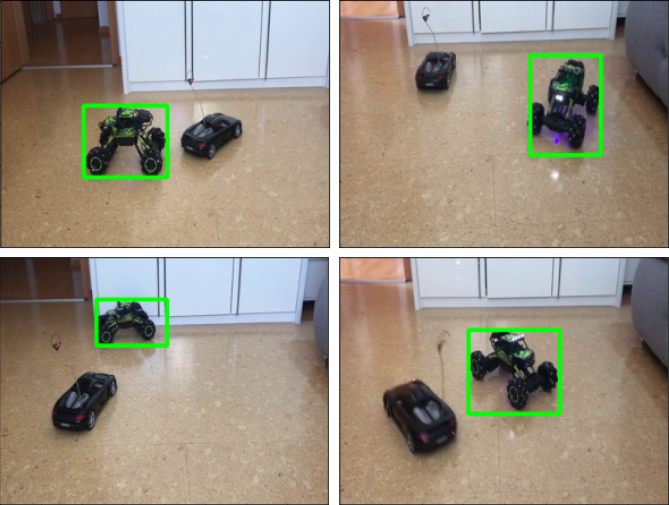

## R-CNN for object detection and motion tracking 

https://user-images.githubusercontent.com/79932218/173047008-fc316eb7-ce81-4787-95e4-6bc811c570d3.mp4

### Objective:
Implementation of an coustomized motion and object detection (Computer Vision) of an arbitrary mobile object using R-CNN (Deep Learning).
The object (remote controlled car) should be recognised in individual images and in videos in order to track its movement.

### Part 1: Generation of data
- Created a custom dataset with images and bounding box labels of the remote controlled car (see folder [base_data](https://github.com/nickjust/RCNN_object_detection/tree/main/base_data)) 
- [Labelimg](https://github.com/nickjust/RCNN_object_detection/tree/main/labelimg) was used to annotate the bounding boxes and for automated saving of the coordinates in .xml format 

  

### Part 2: Preprocessing 
- Preprocessing of the data for the R-CNN algorithm is necessary, more precisely for training the CNN, since the CNN can not learn directly via the bounding box coordinates and expects a fixed size of the input images
- Automated creation of a separate [training dataset](https://github.com/nickjust/RCNN_object_detection/tree/main/training_data) for the CNN classification model, which contains positive and negative examples regarding the object to be classified using OpenCV library and Selective Search algorithm (see script [generate_training_data.py](https://github.com/nickjust/RCNN_object_detection/blob/main/generate_training_data.py))
- Montage of the generated images for both classes:

  

### Part 3: Training of CNN classification model
- Self-developed and trained CNN model using the libraries Tensorflow and Keras for later classification (see script [train_model.py](https://github.com/nickjust/RCNN_object_detection/blob/main/train_model.py) for details). 
- Tensorflow model saved in folder [models](https://github.com/nickjust/RCNN_object_detection/tree/main/model)
- Hyperparametertuning of training parameters and CNN architecture (see script [models.py](https://github.com/nickjust/RCNN_object_detection/blob/main/models.py) for architecture)

### Part 4: R-CNN algorithm and User Interface
- Implemented the R-CNN algorithm with Selective Search, CNN classification model and Non-Maximum-Suppression (see script [rcnn.py](https://github.com/nickjust/RCNN_object_detection/blob/main/rcnn.py))
- Added an additional feature to extract frames of a video and put the frames after detection back together for video reconstruction using OpenCV library
  (see script [video_frame_extractor.py](https://github.com/nickjust/RCNN_object_detection/blob/main/video_frame_extractor.py))
- Developed a User Interface (UI) as main programm in [main.py](https://github.com/nickjust/RCNN_object_detection/blob/main/video_frame_extractor.py) to simplify the execution of the individual tasks for the user: 

  

### Examples of correct detection of the remote controlled car with second object

  

  
